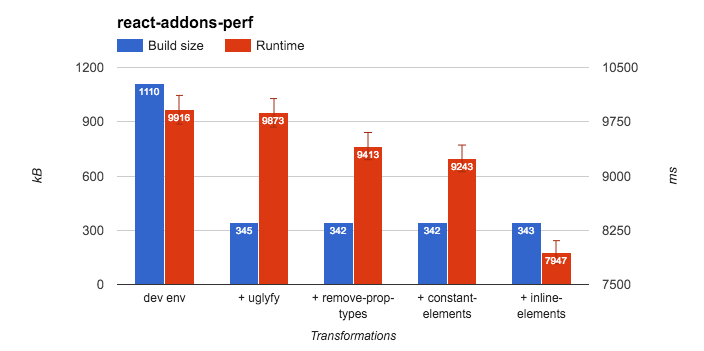
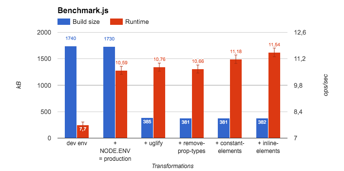

## Get the most of React in production with Babel

React is well know to provide [good performances](https://auth0.com/blog/2016/01/07/more-benchmarks-virtual-dom-vs-angular-12-vs-mithril-js-vs-the-rest/)
out of the box thanks to his **virtual DOM** implementation.

There are [many ways](http://jaero.space/blog/react-performance-1) to speed it up.
Just to state some:
- You can use `process.env.node_env = 'production'` to disable all the checks that React is doing in the development environment.
For instance, that's going to bypass the `propTypes` validation.
- You can prune the reconciliation tree with the `shouldComponentUpdate` lifecycle method. The depth of pruned node matters a lot. The lower the depth is, the better.
- You can smartly use the key property on a long list of elements.
The idea is to give useful information to React so it can identify each element and perform as few DOM mutations as possible.

These three approaches are very efficient.
You will soon or later have to use them as your application grows and you want to give users the
best possible experience.
Sometimes, these speedup tips are **not enough** and you start to investigate ways to push performances further.

## Babel, a powerful tool

You may already now Babel. It has gotten famous by allowing us to **use ES6**,
in production, with [browsers](https://kangax.github.io/compat-table/es6/) that are not supporting it yet.

It used to be called `6to5`, but with the version 6, Babel has become much more than that.
It's now a powerful tool to apply code transformation at the [AST level](https://youtu.be/OZGgVxFxSIs).
You can do such thing with other tools. But this one is pretty convenient.
People may not realize it, but they are already using a lot of AST transformation functions
when they write ES6 and JSX code.
Those ES6 and JSX transformation functions are packaged under two presets:
- `babel-preset-es2015`
- `babel-preset-react`

Things started to be really interesting when Facebook released the version `0.14.0` of React.
They have introduced **two compiler optimizations** that we can enable in production.
We haven't heard anything about it on Twitter nor Medium. We have realized it by carefully reading
the [release note](
https://facebook.github.io/react/blog/2015/10/07/react-v0.14.html#compiler-optimizations
):

> React now supports two compiler optimizations that can be enabled in Babel 5.8.24 and newer. Both of these transforms should be **enabled only in production** (e.g., just before minifying your code) because although they improve runtime performance, they make warning messages more cryptic and skip important checks that happen in development mode, including propTypes.


## Constant hoisting for React elements

The first compiler optimization proposed by Facebook hoists the creation of elements,
that are **fully static**,
to the top level. A component is fully static or [referential transparent](https://en.wikipedia.org/wiki/Referential_transparency) when it can be replaced with its value without changing the behavior.

It's a babel plugin called [transform-react-constant-elements](https://babeljs.io/docs/plugins/transform-react-constant-elements/).
Let's have a look at how it behaves with a simple example:

**In**
```js
const Hr = () => {
  return <hr className="hr" />;
}
```

**Out**
```js
const _ref = <hr className="hr" />;

const Hr = () => {
  return _ref;
};
```

This transform has **two advantages**:
- It tells React that the subtree hasn’t changed so React can completely skip it when reconciling.
- It reduces calls to `React.createElement` and the resulting memory allocations.

However, there are some **limitations** that you should be aware of.
It has two [documented deoptimizations](https://github.com/babel/babel/tree/master/packages/babel-plugin-transform-react-constant-elements/test/fixtures/constant-elements).
It won't work if you are using the `ref` property or if you are spreading properties.

## Inlining React elements

The second compiler optimization proposed by Facebook is replacing the [`React.createElement`](https://github.com/facebook/react/blob/14b19870fe0504cbfb43127983f9aee411334cd6/src/isomorphic/classic/element/ReactElement.js#L117)
function with a more optimized one for production: [`babelHelpers.jsx`](https://github.com/babel/babel/blob/8fb6f878a3843c4cc7dbe20168e633b1551ba699/packages/babel-helpers/src/helpers.js#L14).

It's a babel plugin called [transform-react-inline-elements](https://babeljs.io/docs/plugins/transform-react-inline-elements/).
Let's have a look at how it behaves with a simple example:

**In**
```js
<Baz foo="bar" key="1" />;
```

**Out**
```js
babelHelpers.jsx(Baz, {
  foo: 'bar'
}, key: '1');

/**
 * Instead of
 *
 * React.createElement(Baz, {
 *   foo: 'bar',
 *   key: '1',
 * });
 */
```

The advantage of this transform is **skipping a loop through props**.
The `babelHelpers.jsx` method has a slightly different API than the `React.createElement`.
He accepts a `props` argument that skip this [specific loop](https://github.com/facebook/react/blob/14b19870fe0504cbfb43127983f9aee411334cd6/src/isomorphic/classic/element/ReactElement.js#L140-L146):
```js
// Remaining properties are added to a new props object
for (propName in config) {
  if (config.hasOwnProperty(propName) &&
      !RESERVED_PROPS.hasOwnProperty(propName)) {
    props[propName] = config[propName];
  }
}
```

However, there are some **limitations** that you should be aware of.
It has two [documented deoptimizations](https://github.com/babel/babel/tree/master/packages/babel-plugin-transform-react-constant-elements/test/fixtures/constant-elements).
It won't work if you are using `ref` property or if you are spreading properties.

We have also noticed [one issue](https://github.com/erikras/react-redux-universal-hot-example/pull/1037#discussion-diff-56849536).
You can't use the JSX syntax like this: `<Navbar.Header>`.

## Remove `propTypes`

Looking at the power of the previous transforms,
We have soon been wondering if we couldn't get rid of the `propTypes` in production.
As soon as we set `process.env.node_env = 'production'` all the `propTypes` definitions
are simply **dead code**.

I have found a great plugin written by *Nikita Gusakov* for this specific use case.
Unfortunately, at that time, it was only working with babel 5. I ended up forking it with
[transform-react-remove-prop-types](https://github.com/oliviertassinari/babel-plugin-transform-react-remove-prop-types).
Let's have a look at how it behaves with a simple example:

**In**
```js
const Baz = () => (
  <div />
);

Baz.propTypes = {
  foo: React.PropTypes.string
};
```

**Out**
```js
const Baz = () => (
  <div />
);
```

The advantage of this transform is saving bandwidth. We are not aware of any limitation.

## Let's benchmark this!

Applying plugins to the production build without ways to measure the impact of them is
like shooting in the dark. You shouldn't do it.

How efficient are those optimizations?
At Doctolib, we were wondering the same thing.
We have built a **complex calendar** that can display thousand of appointments with a doctor
on a single view.
We want the interface to be as fast as possible so that doctors can focus on what matters.


Hopefully, some tools are available.

### react-addons-perf

The first tool that we can use to benchmark is an addon built by Facebook: [react-addons-perf](https://facebook.github.io/react/docs/perf.html). It's pretty **convenient to measure wasted time** by component.
In our case, we are going to focus on the inclusive time.
The protocol is the following. I'm rendering 50 times the calendar component with a fair
amount of events (500). In the meantime, `react-addons-perf` is measuring the inclusive time spent. Here are the results:



Notice that we can significantly improve the runtime performance with the three previous transforms. The runtime **win is around 25%** without significant build size impact.

However, we **can't really on this benchmark** as the addons requires `process.env.node_env !== 'production'` to work.
We need a way to benchmark the rendering with `process.env.node_env = 'production'`.

### benchmark.js

The second tool that we have used is React agnostic: [benchmark.js](https://benchmarkjs.com/). The protocol is pretty much the same.
We are mounting and unmounting the calendar component 100 times. Here are the results:



Notice that the very first step benchmarked is setting `process.env.node_env = 'production'`.
The runtime **win is around 7%**.
That's less impressive, but still interesting. Enabling these transforms is cheap.

You can check out [the code](https://github.com/oliviertassinari/react-benchmark/) for this benchmarks.

# To wrap up

We highly advise you to consider adding those different compiler optimizations.
We have already started spreading the word to the community:
- https://github.com/FormidableLabs/spectacle/pull/154
- https://github.com/davezuko/react-redux-starter-kit/pull/561
- https://github.com/kriasoft/react-starter-kit/pull/440
- https://github.com/erikras/react-redux-universal-hot-example/pull/1037

But keep in mind that these transforms should **only be enabled in production**.
They make warning messages more cryptic and skip important checks that happen in development mode, like `propTypes`.
